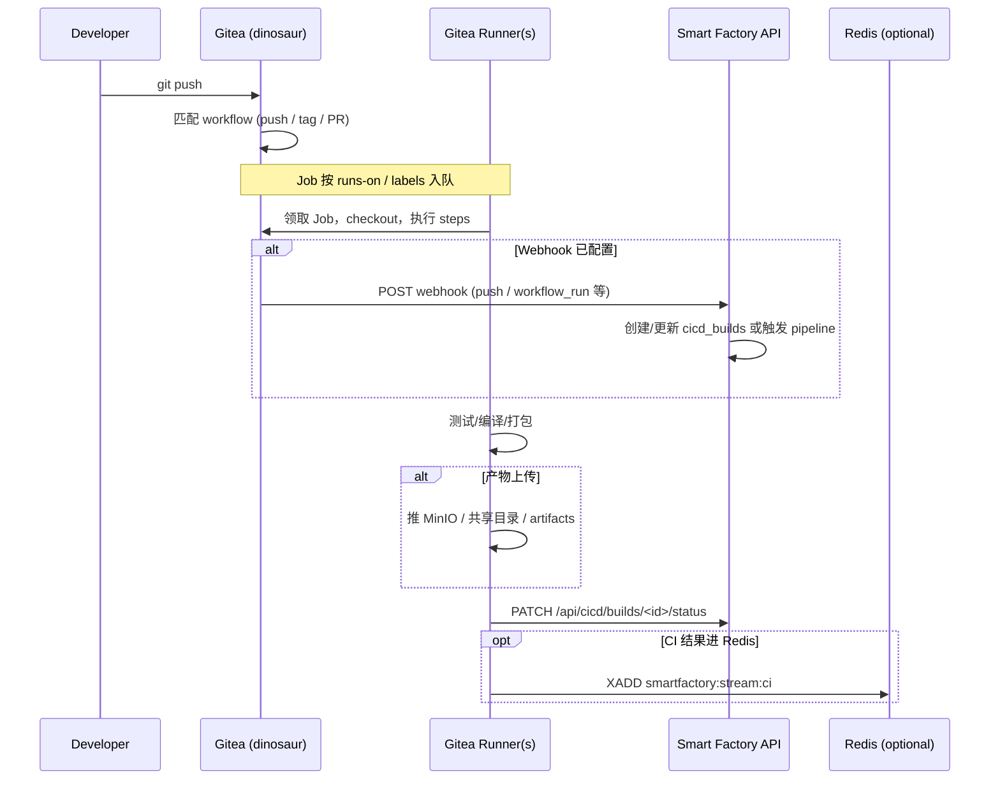

# 本地构建工作流（Gitea Actions + OpenClaw）

本文说明从 **代码推送** 到 **CI 执行**、**制品产出** 与 **Smart Factory 状态回写** 的推荐流程，与 [LOCAL_CICD_BLUEPRINT.md](./LOCAL_CICD_BLUEPRINT.md) 架构一致。

---

## 1. 参与者与职责

| 角色 | 典型主机 | 职责 |
|------|----------|------|
| Git 与调度中心 | dinosaur（Gitea） | 托管仓库、解析 `.gitea/workflows`、将 Job 分发给 Runner |
| 执行器 | dinosaur / vanguard / jarvis / windows / tesla / newton | 按 label 领取 Job，执行 step |
| 编排与知识系统 | vanguard（Smart Factory API + Redis） | Webhook 接收、构建记录、需求分配、可选 `stream:ci` |
| 开发者 | 任意 | `git push` 到 Gitea，修复失败构建 |

---

## 2. 端到端流程（推荐）

---

## 3. 阶段说明

### 3.1 触发（Trigger）

- **推送**：`push` 到指定分支触发默认构建 workflow。
- **Tag / Release**：用于发布流水线（版本号、变更日志）。
- **Pull Request**（若启用）：在合并前做 lint/test。

Workflow 文件位置：**`.gitea/workflows/*.yml`**（与 Gitea 版本文档保持一致）。

### 3.2 调度（Scheduling）

- `runs-on` 或 Gitea 等价字段应与本集群 Runner **label** 对齐，例如：
  - 轻量检查：`linux-x64` + 低并发 runner（dinosaur 或 vanguard）
  - 主构建：jarvis `linux-x64`
  - Windows 专用：windows `windows`
  - Godot/渲染：tesla `linux-x64` + `gpu`（若需要）

### 3.3 执行（Execution）

典型 Job 顺序：

1. **Checkout** 仓库（浅克隆可加速，发布构建建议完整历史）。
2. **环境准备**：缓存依赖、`setup-python` / `setup-node` 等兼容 Action。
3. **静态检查**：lint、format、类型检查。
4. **构建与测试**：单元测试、集成测试；游戏项目可 headless Godot（参见 `openclaw-knowledge/docs/TOOLCHAIN.md`）。
5. **制品**：二进制、Docker 镜像、`export_snapshot` 类产物上传到约定存储。

### 3.4 与 Smart Factory 同步（Reporting）

1. **创建构建记录**：若使用与 GitHub 兼容的推送 Webhook，可配置指向 **`POST /api/webhook/github`**（payload 需与实现匹配）；否则在 workflow 开头由脚本调用内部 API 创建 build 行，或使用未来 **`/api/webhook/gitea`**。
2. **结束状态**：成功/失败必须调用 **`PATCH /api/cicd/builds/<id>/status`**，便于仪表盘与后续自动化。
3. **失败升级**：失败时创建需求（`POST /api/requirements`）或阻塞讨论（`POST /api/discussion/blockage`），由 Vanguard/Hera 按现有流程分配。

### 3.5 可选：Redis CI 流

若团队希望与 `smartfactory:stream:tasks` 解耦，仅广播 CI 事件，建议在文档与代码中统一使用 **`smartfactory:stream:ci`**，字段至少包含：`build_id`、`repo`、`branch`、`status`、`commit_sha`、`url`（Gitea Actions 链接）。

---

## 4. OpenClaw CLI 与人工流程

- 日常开发仍遵循 **OPENCLAW_DEVELOPMENT_FLOW**：领取需求、`develop_requirement` / `test_requirement` 等。
- CI 仅作为 **自动化闸门**：绿构建不替代代码评审；红构建应产生可追踪的工单或需求。

---

## 5. 试点检查清单

- [ ] Gitea 上仓库可 clone/push
- [ ] 至少一台 Runner 在线且 label 与 workflow 一致
- [ ] 一次完整 workflow 绿通
- [ ] `GET /api/cicd/builds` 能看到对应记录（若已接通 API）
- [ ] 备份脚本跑通且做过恢复演练

更详细的软件版本与安装步骤见各 **`DEVICE_*.md`**。
