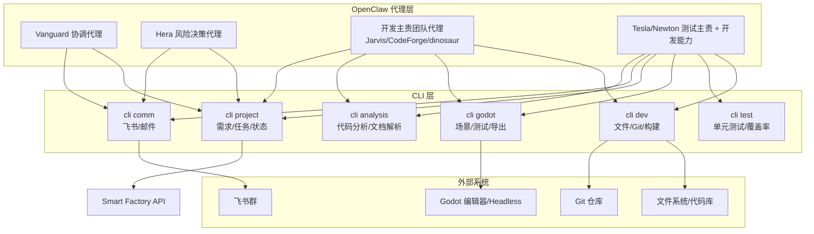

# OpenClaw Communication System Design

> 版本: 3.2 | 更新日期: 2026-04-08  
> **规范对齐**：本文件为**多设备 Vanguard 协调**工作流程叙事与 API 映射；**HTTP  Truth** 以 [docs/REQUIREMENTS.md](../../docs/REQUIREMENTS.md) 为准，**Redis 拓扑**以 [docs/REDIS_COLLABORATION.md](../../docs/REDIS_COLLABORATION.md) 为准，**团队与 IP** 以 [docs/ORGANIZATION.md](../../docs/ORGANIZATION.md) 为准。  
> **并列模式**：单团队由领导直派、**不依赖跨设备 Redis/API 协调**的闭环见 **[OPENCLAW_STANDALONE_WORKFLOW.md](./OPENCLAW_STANDALONE_WORKFLOW.md)**（与本文档同级；DoD 与报告模板共用）。

---

## 1. 概述

OpenClaw **多设备协作**由本文件描述：通信系统协调多物理设备上的代理协作（具体设备表以 **[ORGANIZATION.md](../../docs/ORGANIZATION.md)** 为准，下表为摘要）。**组织架构、联系人、团队成员**同上文档；**vanguard001** 与 **hera** 同机承载 **Smart Factory API + Redis**（见 REQUIREMENTS / REDIS 文档）。需求/任务/测试用例 **分层可读编码 `code`**（`P…-REQ…-TASK…-TC…`）见 [REQUIREMENTS.md](../../docs/REQUIREMENTS.md) §2.0，用于 API 响应、事件载荷与汇报引用。

若当前任务为 **Master Jay / Winnie Chen 直接下达给某一 Team Manager、由该团队独立完成开发与测试**，请改用 **[OPENCLAW_STANDALONE_WORKFLOW.md](./OPENCLAW_STANDALONE_WORKFLOW.md)** 与 `OPENCLAW_DEVELOPMENT_FLOW.yaml` 中的 `execution_modes.team_standalone` / `team_standalone_cycle`；**勿将 Redis `stream:tasks` 消费当作必选路径**。

OpenClaw 多设备协作的关键诉求是“低延迟触发”。您说得对——**基于 cron 轮询的 15-30 分钟延迟确实太慢了**，会让整个智能工厂的响应像“隔夜邮件”一样迟钝。

改用 **Redis Pub/Sub + Streams** 可以做到**亚秒级实时触发**，而且 OpenClaw 官方已经有现成的插件支持。

**执行层**：业务流程（需求分析、任务分配、编码、测试、汇报）封装为可复用的**技能（Skills）**，由 OpenClaw 代理通过 **Smart Factory CLI** 调用（替代原 MCP 服务器）；CLI 与现有 **Smart Factory API / 数据库** 对接，用于持久化与查询；跨代理的触发/转派通过 **Redis 事件总线**完成（不再依赖定时轮询拉取“分配/状态/阻塞”）。本文档定义 CLI 命令清单、Skills 流程，以及与 Redis 事件总线/既有 API 的对应关系。详见 [cli/README.md](../cli/README.md)。

**Agent 用 YAML 流程定义**：结构化、可机读的流程与 API 映射见 [OPENCLAW_DEVELOPMENT_FLOW.yaml](./OPENCLAW_DEVELOPMENT_FLOW.yaml)（含 **协作** 与 **团队独立** 两种 `execution_modes`），便于代理按角色与节奏精确执行。

---

## 2. 硬件与角色

组织层级、团队成员与角色职责以 **[ORGANIZATION.md](../../docs/ORGANIZATION.md)** 为准。摘要如下。

**汇报对象**：向 **Master Jay** 汇报任务进度与状态。**沟通渠道**：飞书群「**福渊研发部**」。

| 团队 | 主机 | IP | 角色标签 |
|------|------|-----|----------|
| Vanguard001 | 树莓派 | 192.168.3.75 | 主控、Gateway |
| Hera | 树莓派 | 192.168.3.75（与 Vanguard 同机） | 项目管理 / 阻塞决策 |
| Jarvis | Mac mini | 192.168.3.79 | 开发 |
| CodeForge | Windows | 192.168.3.4 | 开发 |
| Newton | 树莓派 | 192.168.3.82 | 测试与体验（主责）+ **完整开发**（工具/自动化/fix/feature） |
| Tesla | 树莓派 | 192.168.3.83 | 测试与玩家体验（主责）+ **完整开发**（工具/自动化/fix/feature） |
| dinosaur（未来 NAS） | Mac NAS | 待确认 | 开发/渲染/NAS（与 ORGANIZATION 一致） |

**Vanguard001 团队**（192.168.3.75）：vanguard001（项目管理 + 技术主控）。负责全局调度、**Redis + API 宿主**、派发与日报；详见 ORGANIZATION。

**Hera 团队**（同机）：hera — 阻塞决策与风险；按需 spawn 专业智能体。

**开发主管团队**（Jarvis / CodeForge / **dinosaur**）：主责未开发完成的需求。其 resident 主智能体按任务类型 spawn 专业智能体（如 `mac-developer`、`win-developer`、`bug-fixer`、`render-engineer`）。

**测试主管团队**（Tesla / Newton）：**主责**测试、用例、自动化与玩家体验；**同时具备与开发主管团队同级的开发能力**，可按 Vanguard 分配承担 feature、缺陷修复、测试基建与脚本等开发闭环（`develop_requirement` / `dev_team_cycle`）。resident 主智能体按需 spawn `game-tester`、`ux-reviewer`，在开发任务中可并行 spawn `mac-developer`、`bug-fixer` 等；发现问题后创建 `type=bug` 或 `type=enhancement` 需求，并将反馈汇总给 Hera。

**工作日志规范**：所有角色（Vanguard001 团队、各开发与测试主管团队）在每一步执行后均须记录工作日志，字段：**时间**、**任务名称**、**任务输出**、**任务下一步**。日志用于追溯与飞书汇总。

---

## 3. 系统架构（CLI + Skills）

整个系统由 **Smart Factory CLI** 提供底层命令，**OpenClaw 代理** 通过执行 CLI 命令组合成 **高级技能（Skills）**，由 **Vanguard / Hera 协调代理** 驱动多团队协作。数据与状态仍由 Smart Factory API + SQLite 统一管理；**跨代理触发/转派**通过 Redis Pub/Sub + Streams 事件总线完成；**cli project** 对接本节第 7 节所列 API。无需运行 MCP 服务器进程；设置 `SMART_FACTORY_API` 后直接运行 `python3 -m cli`。



- **cli project**：需求/任务/分配/阻塞等，对应 `/api/requirements`、`/api/teams/*`、`/api/discussion/blockage` 等。
- **cli dev**：文件读写、Git、编译命令，供开发代理使用。
- **cli godot**：打开项目、运行场景、执行 GDScript 测试、导出等。
- **cli test**：运行测试框架（如 GUT、WAT）并解析结果。
- **cli comm**：飞书消息、可选邮件等。
- **cli analysis**：静态分析（如 gdlint）、需求文档解析、变更摘要等。

---

## 3.1 Redis 事件总线（Pub/Sub + Streams）

从版本 2.1 起，跨代理协作统一改为 **Redis 事件驱动**，替代原有“定时轮询 API 发现新分配/状态/阻塞”的通信方式：
- **Redis Pub/Sub**：用于实时触发（无持久化，低延迟）。
- **Redis Streams**：用于持久化任务/结果队列（支持消费者组、ack、失败重试与继续消费）。

OpenClaw 官方插件：`@openclaw/plugin-redis-events`（用于让 Agent 监听 Redis 频道并消费 Streams）。

### 3.1.1 推荐频道/队列规范（prefix = `smartfactory`）

| 目的 | 机制 | 名称（示例） |
|---|---|---|
| 任务派发 | Pub/Sub | `smartfactory:task:dispatch` |
| 任务队列（持久化） | Streams | `smartfactory:stream:tasks` |
| 结果/状态上报（持久化） | Streams | `smartfactory:stream:results` |
| 阻塞上报（实时） | Pub/Sub | `smartfactory:task:blocker` |
| 阻塞上报（持久化） | Streams | `smartfactory:stream:blockers` |

### 3.1.2 参考消息格式（JSON）

任务派发（`task:dispatch`）示例：
```json
{
  "taskId": "TASK_{timestamp}_{random}",
  "requirementId": "T001",
  "type": "development",
  "assignee": "jarvis",
  "priority": "high",
  "payload": { "title": "...", "deadline": "2026-03-20" },
  "callbackStream": "smartfactory:stream:results"
}
```

结果上报（`stream:results`）示例：
```json
{
  "taskId": "原任务ID",
  "requirementId": "T001",
  "status": "completed",
  "result": { "summary": "实现并通过测试" },
  "executionTimeSeconds": 120
}
```

阻塞上报（`task:blocker`）示例：
```json
{
  "taskId": "原任务ID",
  "requirementId": "T001",
  "level": "L2",
  "blocker": "missing_dependency",
  "reason": "依赖版本冲突",
  "attemptedWork": ["..."],
  "suggestedNext": "请求架构师会诊"
}
```

> 注：API 仍保留用于最终落库/查询/报表汇总；但“实时触发链路”由 Redis 完成。

---

## 4. CLI 命令定义

代理通过 **Smart Factory CLI**（`python3 -m cli <domain> <subcommand> [args]`）执行以下能力；输出为 JSON。**cli project** 与第 7 节 API 一一对接。完整命令与示例见 [cli/README.md](../cli/README.md)。

### 4.1 项目管理（cli project）

**用途**：需求、任务、团队状态、分配、阻塞。数据源为 Smart Factory API。需设置 `SMART_FACTORY_API`。

| CLI 命令 | 描述 | 示例 |
|----------|------|------|
| `cli project list-requirements` | 查询需求列表 | `--status new --assignable true` |
| `cli project get-requirement <id>` | 获取单个需求详情 | |
| `cli project create-requirement` | 创建新需求（含 Bug） | `--title "..." --type bug` |
| `cli project update-requirement <id> --fields '{}'` | 更新需求字段 | |
| `cli project assign-requirement <id> --team <team>` | 分配需求给团队 | |
| `cli project take-requirement <id> --team --agent` | 团队领取需求 | |
| `cli project report-status` | 团队上报状态（含 tasks[]：id, status, executor, risk, blocker, next_step_task_id, est_tokens_total, prompt_rounds，会同步到 DB） | `--team --requirement-id --progress --tasks '[]'` |
| `cli project report-task-detail` | 上报需求/任务细节（analysis/assignment/development，用于分析拆解与分配说明） | `--team --requirement-id --detail-type --content [--task-id]` |
| `cli project list-tasks <requirement-id>` | 列出需求下任务（含 next_step_task_id, risk, blocker） | |
| `cli project update-task <id> --fields '{}'` | 更新任务（Hera/服务端重分配、设 next_step_task_id） | `--fields '{"status":"blocked","next_step_task_id":42}'` |
| `cli project report-blockage` | 上报阻塞 | `--team --requirement-id --reason` |
| `cli project list-blockages` | 查询阻塞列表（Hera） | `--status pending` |
| `cli project resolve-blockage <id>` | 决策阻塞（Hera） | `--decision "..."` |
| `cli project list-teams-online` | 在线团队列表 | |
| `cli project get-team-assigned <team>` | 团队已分配需求 | |
| `cli project report-machine-status` | 上报机器状态 | `--team --payload '{}'` |
| `cli project sync-pinball-plan` | 同步 pinball 计划到 DB | 在 DB 所在服务器执行 |

### 4.2 开发环境（cli dev）

**用途**：代码文件、Git、编译构建。在代理本机执行。

| CLI 命令 | 描述 |
|----------|------|
| `cli dev read-file <path>` | 读取文件内容 |
| `cli dev write-file <path> --content "..."` | 写入文件 |
| `cli dev list-dir <path>` | 列出目录 |
| `cli dev git-status <repo_path>` | Git 状态 |
| `cli dev git-commit <repo_path> -m "..."` | 提交变更 |
| `cli dev git-push <repo_path>` | 推送到远程 |
| `cli dev run-command <cmd> [args] --cwd` | 执行白名单命令 |
| `cli dev build <project_path>` | 执行构建 |

### 4.3 Godot 引擎（cli godot）

**用途**：与 Godot 交互。需安装 Godot（或设置 `GODOT_BIN`）。

| CLI 命令 | 描述 |
|----------|------|
| `cli godot open-project <path>` | 验证 Godot 项目 |
| `cli godot run-scene <scene_path> [--project-path]` | 运行场景 |
| `cli godot export-game <preset> <output_path>` | 导出游戏 |
| `cli godot run-tests [--project-path]` | 运行 Godot 测试 |
| `cli godot parse-script <script_path>` | 解析 GDScript |

### 4.4 测试执行（cli test）

**用途**：运行测试框架并收集结果。

| CLI 命令 | 描述 |
|----------|------|
| `cli test run-unit-tests <framework> <test_path>` | 单元测试（pytest/unittest） |
| `cli test run-integration-tests <suite>` | 集成测试 |
| `cli test check-coverage [--format json]` | 覆盖率 |
| `cli test parse-test-output <file_path>` | 解析测试输出 |

### 4.5 通信（cli comm）

**用途**：飞书消息、邮件、飞书 API 日志分析。需 `SMART_FACTORY_API` 或 `FEISHU_WEBHOOK_URL`。

| CLI 命令 | 描述 |
|----------|------|
| `cli comm send-feishu --content "..."` | 发送飞书消息 |
| `cli comm send-email --to --subject --body` | 发送邮件（可选） |
| `cli comm analyze-feishu-logs [--log-file]` | 解析日志、写 DB、返回统计 |
| `cli comm get-feishu-stats [--limit]` | 飞书 API 每日统计 |
| `cli comm analyze-feishu-issues [--log-file]` | 分析日志问题 |

### 4.6 分析（cli analysis）

**用途**：代码静态分析、需求文档解析、变更摘要。

| CLI 命令 | 描述 |
|----------|------|
| `cli analysis analyze-code <path>` | 代码分析（gdlint/pylint） |
| `cli analysis extract-requirements <doc_path>` | 从文档提取需求 |
| `cli analysis estimate-complexity "<text>"` | 估算复杂度 |
| `cli analysis summarize-changes -` | 汇总 git diff（`-` 表示 stdin） |

---

## 5. 高级技能（Skills）定义

Skills 由多个 CLI 命令（或直接调用 API）组合而成，对应第 6 节核心流程中的高层任务。

### 5.1 项目管理类

#### assign_tasks_to_teams
- **执行者**：Vanguard
- **流程**：① `cli project list-requirements --status new --assignable true` 获取待分配需求；② `cli project list-teams-online` 获取在线团队；③ 按优先级与负载依次 `cli project assign-requirement <id> --team <team>`；④ `cli project list-requirements --status developed` 分配给 Tesla；⑤ `cli comm send-feishu --content "..."` 汇报分配结果。

#### handle_blockage
- **执行者**：Hera
- **流程**：① `cli project list-blockages --status pending`；② 对每条 `cli project get-requirement <id>` 获取上下文并决策；③ 若重新分配则 `cli project assign-requirement` 给其他团队，并 `cli project update-requirement` 将原需求置为 blocked 或清空 assigned_team；④ `cli project resolve-blockage <id>` 更新决策；⑤ 可选 `cli comm send-feishu` 通知相关团队。

### 5.2 开发类

#### develop_requirement
- **执行者**：开发团队代理（Jarvis/CodeForge/Newton）
- **流程**：① `cli project get-requirement <id>` 获取需求；② `cli dev read-file` 读相关代码/文档；③ `cli analysis analyze-code` 或 `extract-requirements` 生成分析笔记；④ `cli dev write-file`、`cli dev git-commit` 做代码变更；⑤ `cli godot run-tests` 或 `cli test run-unit-tests` 验证；⑥ `cli project report-status` 更新进度；⑦ 完成后 `cli project update-requirement <id> --fields '{"status":"developed"}'`。

#### godot_build_and_test
- **执行者**：开发/测试团队
- **流程**：① `cli godot export-game` 导出目标平台；② `cli godot run-tests` 或 `cli test run-unit-tests`；③ `cli test parse-test-output` 解析结果；④ 若失败则 `cli comm send-feishu` 报告；⑤ `cli project report-status` 更新测试结果。

### 5.3 测试类

#### test_requirement
- **执行者**：Tesla
- **流程**：① `cli project get-requirement <id>` 获取待测需求；② `cli godot run-scene` 加载相关场景；③ `cli godot run-tests` / `cli test run-unit-tests` 执行自动化测试；④ 若发现问题 `cli project create-requirement --type bug --title "..."`；⑤ `cli project report-status` 上报测试结果与 Bug；⑥ 通过则 `cli project update-requirement <id> --fields '{"status":"tested"}'`。

### 5.4 汇报类

#### generate_daily_report
- **执行者**：Vanguard
- **流程**：① `cli project list-teams-online`；② 各团队 `cli project get-team-assigned <team>` 及状态汇总；③ `cli analysis summarize-changes` 汇总代码变更；④ `cli comm send-feishu --content "..."` 发送格式化日报（进度、风险、机器状态）。

### 5.5 辅助类

#### parse_requirement_doc
- **执行者**：任意代理
- **流程**：`cli analysis extract-requirements <doc>` 从 PRD 文档提取需求点，再 `cli project create-requirement` 批量创建。

### 5.6 运维/计划类

#### sync_game_plan
- **执行者**：Vanguard / ops（在 DB 所在服务器执行）
- **流程**：`cli project sync-pinball-plan` 将 pinball-experience BASELINE_STEPS / FEATURE_STEPS 同步到 Smart Factory DB（在 DB 所在服务器执行）；或 `python -m skills.sync_game_plan`。

#### feishu_api_health_report
- **执行者**：Vanguard / ops
- **流程**：`cli comm analyze-feishu-logs`、`cli comm analyze-feishu-issues` 分析 Gateway 飞书 API 日志，可选 `--post` 发飞书；或 `python -m skills.feishu_api_health_report`。

---

## 6. 核心流程

### 6.1 Vanguard001 协调流程（Redis 派发 + API 持久化）

**Skill**：`assign_tasks_to_teams`（cli project + cli comm）。每次将需求分配给团队时：**必须**同时 **`PUBLISH smartfactory:task:dispatch`** 并 **`XADD smartfactory:stream:tasks`**（字段见 [docs/REDIS_COLLABORATION.md](../../docs/REDIS_COLLABORATION.md)）。下列步骤中的 **`GET /api/requirements` 等仅用于 Vanguard 决策与写库**；执行机**不得**依赖轮询这些接口发现新任务。

1. **检查在线团队数量**：`cli project list-teams-online` / `GET /api/teams/online`（基于机器心跳、machine_status 2h 内、或 status_report 40 分钟内）。**工作日志**：记录时间、任务名称「检查在线团队」、输出（在线团队列表）、下一步「检查需求列表」。
2. **检查需求列表**（供分配决策）：`cli project list-requirements` / `GET /api/requirements`（可按 status、priority、id 排序）。**非**团队任务订阅主路径。
3. **分配策略**：优先按 **priority** 分配，同优先级按 id 或创建时间；**负载感知**：从团队状态汇总获取任务数/剩余工时，优先分配给空闲或负载低的团队；**type=bug** 视为高优先级。仅分配 **depends_on** 已满足的需求。
4. 给**每个开发团队**分发未开发完成且可分配的需求（`status=new`，含 type=bug）：`cli project assign-requirement <id> --team <team>` / `POST /api/requirements/<id>/assign`（assigned_team = jarvis/codeforge/newton）；**随后 Redis**：`PUBLISH` + `XADD`（payload 含 assignee、requirementId/taskId）。**工作日志**：记录分配的需求 ID、目标团队、下一步「给 Tesla 分配」。
5. **给 Tesla / Newton** 分发开发完成、尚未测试的需求：同上（assign API **+ Redis 派发**）。**工作日志**：记录分配结果、下一步「汇总发飞书」。
6. 汇总各团队状态与风险，汇报飞书「福渊研发部」群（含系统健康度）：`cli comm send-feishu --content "..."` / `POST /api/feishu/post`。**工作日志**：任务名称「飞书汇总」、输出（报告链接或摘要）、下一步「等待下一周期」。

### 6.2 开发/测试主管流程（主智能体 + 按需 Spawn 专业智能体）（Redis 事件触发）

**开发主管团队（jarvis / codeforge / dinosaur）** — **Skill**：`develop_requirement`（cli project + cli dev + cli godot/test + cli analysis）。
resident 主智能体负责需求落地，并在本地通过 `sessions_spawn` 按需 spawn 专业智能体 executor（如 `mac-developer` / `win-developer` / `bug-fixer` / `render-engineer` / `nas-manager`）。

**子任务拆解与执行流程**：

1. **检查分发给自己的任务**：**主路径** — 消费 **`smartfactory:stream:tasks`**（`dev-teams` / `test-teams`）；**核对/降级** — `cli project get-team-assigned <team>` / `GET /api/teams/<team>/assigned-requirements`。**工作日志**：「拉取分配需求」、输出（需求 ID 列表）、下一步「领取/分析」。
2. **领取任务**（如有）：`cli project take-requirement <id> --team <team> --agent <agent>` / `POST /api/requirements/<id>/take`（assigned_team, assigned_agent）。`<agent>` 使用 [ORGANIZATION.md](../../docs/ORGANIZATION.md) 中的 resident 主智能体 id（jarvis / codeforge / dinosaur）；子任务 executor 由主智能体通过 `sessions_spawn` 动态生成。
3. **主智能体：需求分析与 Spawn executor（≤ 2 小时粒度）**：
   - 主智能体基于需求与现有代码，分析技术方案，补充/更新 `depends_on`，划出关键路径。
   - 主智能体将需求拆分为**预计用时不超过 2 小时**的子任务（含目标、验收条件、依赖项），并选择对应 executor；Spawn enforcement：在分配 executor 之前必须确认对应子 agent 已通过 OpenClaw `sessions_spawn` 启动，并在 `organization/workspace/<team>/协作scrum.md` 中标记 `executor_spawned=true`（杜绝分配给未启动 agent 导致 pending/兜底）。
   - **工作日志**：任务名称「需求分析与任务拆解」、输出（子任务列表、depends_on、预估工时），下一步「专业智能体执行」。
4. **专业智能体执行与进度跟踪**：
   - 专业智能体（executor）根据分配的子任务进行实现与测试，必要时调用 `cli dev`、`cli godot`、`cli test` 等命令。
   - Team Main 至少每个站会周期（参考 6.6）主动通过 `cli project report-status` 或内部会话检查子任务状态，对超过预估工时 **1.5 倍**仍未完成的子任务发起进度询问与原因收集。
5. **团队负责人上报状态**：`cli project report-status --team <team> --requirement-id <id> ...` / `POST /api/teams/<team>/status-report`（requirement_id、progress、tasks[]）；支持**增量上报**。tasks 中应体现：
   - 已拆解子任务列表（含 executor、status、risk、blocker、next_step_task_id）
   - 关键子任务的分析/分配/开发说明（`analysis_notes`、`assignment_notes`、`development_notes`）
6. **需求/任务完成时**：提交 **《开发任务报告》**（[开发任务报告模版](../standards/report/DEVELOPMENT_TASK_REPORT_TEMPLATE.md)），随 status-report 或 task-detail 上报。
7. **若遇到阻塞或需决策**：`cli project report-blockage --team ... --requirement-id ... --reason "..."` / `POST /api/discussion/blockage`（见 7.4），由 Hera 协调。**工作日志**：阻塞原因、当前子任务、已尝试方案、下一步「等待 Hera 决策」。在上报前：
   - **L1 环境问题**：先由团队 DevOps（hermes / yu / cybertruck / 本地运维）尝试修复。
   - **L2 技术难题**：先由主智能体或其 spawn 的 `tech-researcher` 在团队内做一次 quick review（检查知识库与相关实现）。
   - **L3 资源/依赖冲突**：由 Team Main 在团队内协调（调整执行顺序或需要的 executor spawn）。

**测试团队（Tesla / Newton）** — **Skill**：`test_requirement`（cli project + cli godot + cli comm）。resident 主智能体负责测试与玩家体验：按需 spawn `game-tester` 与 `ux-reviewer` 执行用例/回归与体验收集；发现问题创建 `type=bug` / `type=enhancement` 需求并反馈给 Hera。

1. 检查分配、领取测试需求（同上 1–2），记录工作日志。
2. 执行测试（godot-mcp `run_scene` / `run_tests`）；发现问题时 `create_requirement`（type=bug）/ `POST /api/requirements`（见 6.3）。
3. **玩家体验游玩与改进收集**：运行 `cli godot run-scene <play_scene_path> [--project-path <game_path>]` 以玩家视角游玩关键流程；若属于 Bug 则走 bug 创建流程；若属于非 Bug 的 UX/玩法/引导/平衡/可用性等改进点，则创建 `type=enhancement` 的改进建议（见 6.3.1）。
4. **本周期完成时**：如本周期包含测试执行：提交 **《测试任务报告》**（[测试任务报告模版](../standards/report/TEST_TASK_REPORT_TEMPLATE.md)），随 status-report 上报；同时将玩家体验改进要点（可复现步骤/期望行为/影响范围）写入 status-report 的 tasks[] 或通过 created enhancement 作为跟踪入口。

### 6.3 Tesla 测试发现问题：创建 Bug 需求

Tesla 测试团队在测试过程中发现问题时，**在数据库中创建一条 Bug 需求**（与普通需求同一套表，`type=bug`）：

1. **创建 Bug 需求**：`cli project create-requirement --type bug --title "..." --description "..."` 或 `POST /api/requirements`，body 中 `type: "bug"`，填写 title、description、project_id、关联原需求或步骤（可在 description 中说明）。
2. Bug 需求与普通需求一样参与下一轮分配：**Vanguard001** 在每次 **`assign` + Redis 派发** 周期把 `status=new` 的需求（含 type=bug）按策略分配给开发团队；**Hera** 与开发团队将其当作新需求处理并在实现中修复。
3. 修复完成后需求关闭，测试可再次验证原场景。

### 6.3.1 Tesla 玩家体验发现改进：创建 Enhancement 需求

Tesla 玩家体验过程中发现非 Bug 的改进点时，**在数据库中创建一条 Enhancement 需求**（`type=enhancement`），例如：

1. **创建 Enhancement 需求**：`cli project create-requirement --type enhancement --title "..." --description "..."` 或 `POST /api/requirements`，body 中 `type: "enhancement"`；description 中说明期望行为、当前行为、可复现步骤/场景与影响范围。
2. Enhancement 需求与普通需求同一套流程参与下一轮分配：Vanguard **`assign` + Redis 派发** 将 `status=new` 的 enhancement 分给开发团队；实现完成后 Tesla/玩家再次验证体验。

### 6.4 开发团队依赖阻塞与跨团队调度：Hera 决策 + Vanguard 弹性分配

当开发团队收到的任务**因依赖或资源问题无法完成**时，进入**blocker 分级 + 专家会诊 + 弹性调度**流程。

1. **开发团队识别并上报 blocker**：`cli project report-blockage ...` / `POST /api/discussion/blockage`，payload 中需包括：
   - `reason`：说明问题，并标注初步等级（L1/L2/L3）和涉及的文件/模块。
   - `depends_on` 或相关 requirement / task id（如是依赖阻塞）。
   - 已尝试的临时方案（若有）。
   **Skill**：`handle_blockage`（Hera）。
2. **Hera 基于等级的处理策略**（收到阻塞事件后）：
   - **L1（环境/工具）**：优先由对应团队 DevOps（hermes / yu / cybertruck / 本地运维）处理；Hera 记录决策并更新 blockages 状态，必要时在同一团队内切换到不依赖该环境的其他需求。
   - **L2（技术难题/架构问题）**：Hera 发起**专家会诊**：
     - 通过知识库 `/home/pi/.openclaw/shared/knowledge_base.md` 与相关代码（如 Godot 场景、API 实现）收集上下文。
     - 邀请对应领域的专家（例如由 resident 主智能体 spawn 的 `tech-researcher` / 开发或渲染专家）参与决策，形成替代方案或折中实现路径。
   - **L3（资源/跨团队冲突）**：涉及多个团队或同一模块频繁冲突时：
     - Team Main 先在团队内调整任务顺序、并重新选择/再 spawn executor。
     - 若仍无法在合理时间内解除（参考子任务预估工时的 1.5–2 倍），Team Main 可请求 **Vanguard001 进行跨团队重新分配**。
3. **Hera 的决策动作**：
   - **重新 assign 可做任务**：`cli project assign-requirement <other_id> --team <team>` / `POST /api/requirements/<other_id>/assign`，将另一条可分配需求分配给该团队，让团队保持高效工作。
   - **延后当前任务**：`cli project update-requirement <id> --fields '{"status":"blocked"}'` / `PATCH /api/requirements/<id>` 或清空 `assigned_team`，待依赖或 blocker 解除后再分配。
   - **基于依赖图重新组合需求包**：将强相关需求集中到同一团队，减少跨团队依赖导致的阻塞。
4. **Vanguard001 的弹性跨团队调度（可选）**：
   - 当某个团队在同一需求或同一模块上出现**长时间阻塞或多次 L2/L3 blocker** 时，Team Main 可通过状态报告与 Hera 协调，由 Hera 向 Vanguard001 提交跨团队转派建议。
   - Vanguard001 在下一轮分配时，可将部分需求（例如特定平台实现、跨平台适配、纯文档/设计任务）转派给其他团队（如 Windows 团队 CodeForge 或创新团队 Newton），缓解单团队压力。
5. 前置任务或 blocker 解决后，原被延后的需求由 Vanguard 或 Hera 再次分配，团队领取并继续执行。

### 6.5 Hera 协调与决策流程（收到阻塞事件后）

**Skill**：`handle_blockage`（cli project + cli comm）。Hera 是**风险“闭环”负责人**，确保 blocker 不只是被记录，而是快速转化为可执行决策。

1. **检查是否有任务上报阻塞**：**主路径** — 消费 **`smartfactory:stream:blockers`** / 订阅 **`smartfactory:task:blocker`**；**辅助** — `cli project list-blockages --status pending` / `GET /api/discussion/blockages?status=pending` 及 `GET /api/dashboard/risk-report`。**工作日志**：「检查阻塞与风险」、待处理条数、下一步「决策」。
2. **读取上下文并判断等级**：
   - 对每条阻塞使用 `cli project get-requirement <id>`、`cli project list-tasks <req_id>` 获取上下文。
   - 结合上报信息与团队状态（status-report/summary），判断为 L1/L2/L3，并决定是否需要发起**专家会诊**（技术专家/DevOps/Team Main 参与；必要时由 Team Main spawn 对应专家）。
3. **做出决定并写回系统**：通过 `cli project assign-requirement` / `update-requirement` / **`update-task`**（设 next_step_task_id、risk、blocker）/ `resolve-blockage` 让团队继续推进；必要时通过 `cli comm send-feishu` 通知相关团队和 Master Jay。**工作日志**：每项决策（任务名称、输出、下一步）。
4. **知识沉淀与复用**：
   - 对于具有代表性的 blocker，Hera（或相关 Team Main 协同）应将解决思路记录到共享知识库（例如 `/home/pi/.openclaw/shared/knowledge_base.md`），包括问题特征、排查步骤、最终方案。
   - 后续团队在遇到类似问题时，需先查阅知识库与相关文档，再发起新的 blocker 上报。
5. 团队继续工作直至需求/任务完成。
6. 由 **Vanguard001** 执行 **Skill** `generate_daily_report`（`python -m skills.generate_daily_report`）：汇总状态、风险、任务明细与开发细节、机器状态，经 `cli comm send-feishu` 或 `POST /api/feishu/post` 发飞书「福渊研发部」向 Master Jay 汇报。可选：集中收集各代理日志（如 ELK、Loki）。

### 6.6 团队上报通道 (Team → Team Main → Hera → Vanguard → Feishu)

1. **团队上报**（事件驱动）：通过写入 Redis Streams（推荐 `smartfactory:stream:results`）上报；或在兜底阶段仍可通过 **cli project report-status** / `POST /api/teams/<team>/status-report`。在实践中：
   - 建议由 **Team Main 汇总子任务执行情况**，并代表团队触发或协助生成状态报告。
   - **Team Main** 关注整体进度曲线与风险分布，必要时在报告中添加针对 Hera/Vanguard 的备注（例如建议跨团队转派、资源调整等）。
   - payload: `{ requirement_id, requirement_title, progress_percent, step, tasks: [{id, title, status, executor, analysis_notes?, assignment_notes?, development_notes?, risk?, blocker?, next_step_task_id?}], machine_info? }`。带 **id** 的 tasks 条目会**同步到 DB**（status、executor、risk、blocker、next_step_task_id），供服务端重分配与「下一步任务」流程使用。支持**增量上报**（仅上报发生变化的任务）。GET 支持 `?since=<timestamp>` 增量拉取；历史状态定期归档或清理，避免库膨胀。
   - 任务级**分析/分配/开发细节**可放在 `tasks[].analysis_notes`、`assignment_notes`、`development_notes` 中，或通过 **cli project report-task-detail** / **任务开发细节 API** 单独上报（见下）。
   - **下一步任务流程**：任务阻塞时可设 `status=blocked`、`next_step_task_id=<修 Bug 任务 id>`；先完成 next_step 任务（如 Bug 修复），再由 Hera/服务端清除 next_step_task_id 并恢复原任务。Team Main 负责在团队内追踪这些“下一步任务”，避免遗忘。
   - **Skill**（推荐）：`python -m skills.report_team_status --team <team>`；或 `cli project report-status`；或 `python -m skills.develop_requirement` / `test_requirement` 内上报。Team Main 应至少在**每日站会**时（可由各团队自行约定具体时间，如 9:00）使用该 Skill 主动检查所有活跃需求与子任务的状态，并推动超时任务的分析与处理。
   - **活跃判定**：最近一次上报在 **40 分钟内** 视为 **active**，否则 **offline**。当某团队长时间 offline 或多次错过上报窗口时，Hera 与 Vanguard 应在日报或单独飞书中提醒，并评估是否需要调整任务分配或优先级。

2. **任务开发细节上报**（随开发过程）：`POST /api/teams/<team>/task-detail`
   - Body: `{ requirement_id, task_id, detail_type: "analysis"|"assignment"|"development", content }`
   - 用于汇报**分析细节**（需求拆解、方案要点）、**任务分配细节**（谁负责哪项、依据）、**开发细节**（实现要点、结论、风险）。Hera 可查看，并与其他结果一起进入**最终报告**。

3. **Hera 汇总**：`GET /api/teams/status-report/summary`、`GET /api/teams/development-details/summary`
   - 各团队最新状态报告（含任务明细）；开发过程细节按团队汇总，供最终报告使用。

4. **Vanguard 发飞书（最终报告）**：运行 **Skill** `generate_daily_report`（`python -m skills.generate_daily_report`）；或通过 **cli comm send-feishu** 发送格式化内容至飞书群「福渊研发部」，向 Master Jay 汇报。
   - 拉取 status-report/summary、**development-details/summary**、risk-report、machine-status
   - 最终报告中包含：**团队状态与任务明细**、**各团队开发过程细节**（分析/分配/开发）、风险提示、机器状态。

---

## 7. API 设计（与实现一致）

> **Redis 优先**：跨团队派发/进度/阻塞的**主路径**是 [docs/REDIS_COLLABORATION.md](../../docs/REDIS_COLLABORATION.md) 中的 Streams 与频道；本节 HTTP 路由用于**持久化、仪表盘、会议轮询、Redis 降级**。  
> **project-mcp 对接**：工具与本节 API 一一对应（如 `list_requirements` → `GET /api/requirements`，`assign_requirement` → `POST /api/requirements/<id>/assign`）。`assign` 后须配合 **Redis 派发**（或由 Skill 统一完成）。  
> **OpenClaw 发现 API**：`GET /api/` 或 `GET http://<host>:5000/api/` 返回可用端点列表。

### 7.1 需求分配（Vanguard / Hera 使用）

| 实际路径 | 方法 | 说明 |
|----------|------|------|
| `GET /api/requirements` | GET | 列表；可选 `?status=`、`?priority=`、`?assigned_team=`、**`?assignable=1`**（仅返回 status=new 且依赖已满足的需求，供 Vanguard 分配）；`?sort=priority_asc`（默认，bug 优先）或 `sort=created_asc`。 |
| `/api/requirements/<rid>/assign` | POST | Vanguard 分配需求；若需求有 `depends_on` 且未全部完成则返回 400。**Hera** 在依赖阻塞时也可用此接口给开发团队**重新分配**另一条需求。Body: `{"assigned_team": "jarvis"}` |
| `PATCH /api/requirements/<rid>` | PATCH | 更新需求；Hera 将延后任务设 `status=blocked` 或清空 `assigned_team`。扩展字段：`priority`、`depends_on`（数组，由开发分析时填写）。 |

**示例**：`POST /api/requirements/74/assign`（74 为需求 ID）

### 7.2 团队任务查询

| 实际路径 | 方法 | 说明 |
|----------|------|------|
| `/api/requirements?assigned_team=<team>` | GET | 按团队过滤需求 |
| `/api/teams/assigned-requirements?team=<team>` | GET | 同上，**必须带 ?team=jarvis** |
| `/api/teams/<team>/assigned-requirements` | GET | 同上，团队在路径中。**示例**：`/api/teams/jarvis/assigned-requirements` |

**错误示例**：`GET /api/teams/requirements` ❌（无此路径，应为 `assigned-requirements` 且需 team）

### 7.3 机器/团队状态

| 实际路径 | 方法 | 说明 |
|----------|------|------|
| `/api/machines/<mid>/status` | POST | 更新机器在线状态 |
| `/api/teams/<team>/machine-status` | POST | 团队上报机器状态 |
| `/api/teams/<team>/machine-status` | GET | 获取某团队最近状态 |
| `/api/teams/online` | GET | 列出在线团队（含 status_report 40 分钟内视为在线） |
| `/api/teams/machine-status/summary` | GET | 各团队机器状态汇总 |

### 7.4 讨论与风险处理（Team 上报阻塞 → Hera 协调）

团队遇到阻塞或需决策时上报，Hera 收到阻塞事件后立即做出决定并让团队继续工作（不可用时再回退到定时检查）。

| 实际路径 | 方法 | 说明 |
|----------|------|------|
| `POST /api/discussion/blockage` | POST | 团队上报阻塞/需决策项。Body: `{ "team", "requirement_id", "task_id?", "reason", "options?" }`。**依赖阻塞**时 reason 可注明「依赖前置任务未完成」，便于 Hera 做重新分配与延后。 |
| `GET /api/discussion/blockages` | GET | Hera 查询待处理阻塞列表（可选 ?status=pending） |
| `PATCH /api/discussion/blockage/<id>` | PATCH | Hera 更新决策结果（如 status=resolved, decision, updated_at） |
| `GET /api/dashboard/risk-report` | GET | Hera 风险报告（超时、阻塞、进度异常）；可与 blockages 结合使用 |

### 会议会诊机制（新增：阻塞/主题 -> 多 agent 会诊 -> 结论 -> 需求创建/分配）
主持人（hera 或 vanguard001）发起会诊会议，参会 agent 每 15 分钟通过 heartbeat 检测是否需要提交输入；当主持人收到足够的输入后 finalize 会话并创建/分配对应 requirements，其他 agent 在会议 concluded 后结束参与。

| 实际路径 | 方法 | 说明 |
|----------|------|------|
| `POST /api/meetings` | POST | 创建会议：topic、problem_to_solve、host_agent、participants（agent id + contribute_focus） |
| `GET /api/meetings/for-agent?agent=<id>` | GET | 获取当前该 agent 相关的 running 会议，并返回 `needs_your_input` 等状态 |
| `GET /api/meetings/<id>` | GET | 读取会议主题与自身 participant 信息（可选 `?agent=<id>`） |
| `POST /api/meetings/<id>/inputs` | POST | 提交本 agent 的 analysis/comments（meeting.current_round 轮次） |
| `GET /api/meetings/<id>/inputs` | GET | 读取其他 agent 的 inputs：可用 `?agent=<id>&exclude_self=1&since=` 增量轮询 |
| `POST /api/meetings/<id>/finalize` | POST | 主持人最终结论：写入 conclusion_summary 并创建 requirements（写入 assigned_team/assigned_agent） |

### 7.5 团队状态上报（含任务明细）→ Hera → Vanguard

| 实际路径 | 方法 | 说明 |
|----------|------|------|
| `/api/teams/<team>/status-report` | POST | 团队上报状态（payload 含 tasks[]）；可增量上报仅变更任务；事件驱动时推荐改为写入 `smartfactory:stream:results`，该接口保留兜底/补写。tasks 中可带 `analysis_notes`、`assignment_notes`、`development_notes`。 |
| `/api/teams/<team>/status-report` | GET | 获取某团队最近报告；可选 `?since=<timestamp>` 仅返回该时间后的变更，用于增量拉取与归档。 |
| `/api/teams/status-report/summary` | GET | Hera 汇总各团队最新报告；每条带 `active`（40 分钟内为 true）、`workload.in_progress_count`（负载感知用）。 |
| `/api/dashboard/risk-report` | GET | Hera 风险报告 |

### 7.6 任务开发过程细节与报告（进入最终报告）

| 实际路径 | 方法 | 说明 |
|----------|------|------|
| `POST /api/teams/<team>/task-detail` | POST | 团队汇报**特定任务**的开发过程细节。Body: `requirement_id`, `task_id`, `detail_type`（analysis \| assignment \| development）, `content` |
| `GET /api/teams/<team>/task-details` | GET | 查询某团队已上报的任务细节；可选 `?requirement_id=`、`?limit=` |
| `POST /api/teams/<team>/report` | POST | 提交**开发任务报告**或**测试任务报告**（规范模版见第 11 节）。Body: `requirement_id`, `report_type`（development \| test）, `content`（JSON 或文本） |
| `GET /api/teams/<team>/reports` | GET | 查询某团队的开发/测试报告；可选 `?requirement_id=`、`?report_type=`、`?limit=` |
| `GET /api/teams/development-details/summary` | GET | 各团队开发过程细节 + 开发/测试报告汇总（Hera/Vanguard 用于最终报告）；可选 `?per_team=` 每团队条数 |

**最终报告**：Vanguard 运行 **Skill** `generate_daily_report`（或脚本 `vanguard_post_feishu_summary.py`）时，会拉取上述 summary，在飞书群「福渊研发部」汇总中展示**各团队的分析细节、任务分配细节、开发细节及开发/测试任务报告**，与状态、风险、机器状态一并向 Master Jay 呈现。

### 7.7 工作日志（所有角色）

| 实际路径 | 方法 | 说明 |
|----------|------|------|
| `POST /api/work-log` | POST | 记录工作日志。Body: `role_or_team`, `task_name`, `task_output`, `next_step`（时间由服务端生成） |
| `GET /api/work-logs` | GET | 查询工作日志；可选 `?role_or_team=`、`?since=`、`?limit=` |

### 7.8 飞书集成

| 实际路径 | 方法 | 说明 |
|----------|------|------|
| `/api/feishu/post` | POST | 向飞书群「福渊研发部」发送消息（需 FEISHU_WEBHOOK_URL） |

---

## 7.9 OpenClaw 常见错误与正确用法

| 错误调用 | 正确调用 |
|----------|----------|
| `GET /api/teams/requirements` | `GET /api/teams/jarvis/assigned-requirements` 或 `GET /api/teams/assigned-requirements?team=jarvis` |
| `POST /api/requirements/assign`（缺少 id） | `POST /api/requirements/74/assign`（74 为需求 ID） |
| `GET /api/teams//assigned-requirements`（双斜杠） | `GET /api/teams/jarvis/assigned-requirements` |

**API 发现**：调用 `GET http://<host>:5000/api/` 可获取完整端点列表。

---

## 8. 事件驱动任务与可靠性（Redis + 兜底 Cron）

| 角色 | 触发方式 | 推荐方式（Skills / Redis / MCP） |
|------|----------|--------------------------|
| Vanguard001 | **Redis 事件**（需求可分配/任务需要派发时） | **Skill** `assign_tasks_to_teams`：持久化 DB 分配后向 `smartfactory:task:dispatch` / `smartfactory:stream:tasks` 推送；每日汇总可仍用 **Skill** `generate_daily_report`。关键操作使用指数退避重试。 |
| 开发团队 & Tesla | **Redis 队列消费**（Streams consumer group） | 订阅/消费 `smartfactory:stream:tasks`；执行完成后写入 `smartfactory:stream:results`；Redis 不可用时可回退到原有 `cli project report-status` 流程。 |
| Hera | **Redis 阻塞事件** | 订阅/消费 `smartfactory:task:blocker` / `smartfactory:stream:blockers` 后立即执行 **Skill** `handle_blockage`；不可用时回退为定时检查。 |

**可靠性**：关键链路采用 Redis Streams（consumer groups）保证投递与可重试；对写入 DB/API 的关键操作仍使用**指数退避重试**；并保留“事件通道不可用时回退到 API + Cron”的兜底策略。

**演练与测试**：
- **24 小时流程演练**：完整设计见 [24H_WORKFLOW_TEST_DESIGN.md](./24H_WORKFLOW_TEST_DESIGN.md)。目标：验证 Vanguard 分配 → 团队 take → 分析拆解 → 分配执行 → 开发/测试报告与汇总；含需决策任务的处理。验收：分发、分析、分配、决策记录、报告完成，Vanguard 汇总发飞书。
- **故障注入**：定期模拟某台设备离线、网络分区、API 超时，验证重分配、离线判定、重试后一致性。
- **每日冒烟测试**：轻量脚本验证「分配 → 领取 → 上报」核心流程可用。

---

## 9. Godot MCP 深度集成建议

Godot-MCP 可与现有流程中的「运行场景」「执行测试」等步骤对接，有两种实现方式：

1. **基于命令行**：利用 Godot 的 `--script` 参数运行自定义 GDScript，脚本通过标准输入/输出与 MCP 服务器通信。例如启动 Godot 时加载插件脚本，暴露 JSON-RPC 接口。
2. **原生 MCP 插件**：为 Godot 开发 MCP 插件，作为编辑器或运行时服务，通过 WebSocket 或 stdio 与外部通信，可直接使用编辑器 API。

建议初期用命令行方式快速验证，后续再开发插件提升性能。

示例 GDScript 工具（通过 `godot --headless --script godot_tools.gd -- --command run_scene --scene res://test.tscn` 调用）：

```gdscript
# godot_tools.gd 示例
func run_scene(scene_path):
    var scene = load(scene_path)
    var instance = scene.instantiate()
    add_child(instance)
    await get_tree().process_frame
    var screenshot = get_viewport().get_texture().get_image()
    screenshot.save_png("screenshot.png")
    return {"status": "ok", "screenshot": "screenshot.png"}
```

---

## 10. 部署与安全

- **进程与部署**：各 MCP 服务器可运行在独立容器或进程中，通过 OpenClaw 的 `mcpServers` 配置引入。树莓派上可运行轻量级 MCP（如 project-mcp、comm-mcp）；Godot-MCP 建议部署在性能较好的 Mac/Windows 上。
- **敏感操作**：对文件写入、命令执行等实施**白名单**机制，可通过 OpenClaw 的 `exec-approvals.json` 或等效配置控制。
- **认证**：跨设备通信建议加密（内网可简化）；API 调用需认证时可使用简单 API Key 头。

---

## 11. 规范汇报模版

> **执行方式**：代理通过 **MCP 工具** 与 **Skills** 上报/汇总，不直接调用 API。见 [standards/report/README.md](../standards/report/README.md)。

| 模版 | 用途 | 文件 | 执行方式 |
|------|------|------|----------|
| 团队状态汇报 | **优先** Redis `stream:results`；可兜底定时落库（20 分钟–1 小时）：项目、需求、任务、机器、阻塞 | [standards/report/TEAM_STATUS_REPORT_TEMPLATE.md](../standards/report/TEAM_STATUS_REPORT_TEMPLATE.md) | `XADD stream:results`；project-mcp `report_status`、`report_blockage`；Skill `develop_requirement`、`test_requirement` |
| 最终日报（Hera & Vanguard） | 汇总各团队、机器、风险、讨论后发飞书「福渊研发部」向 Master Jay 汇报 | [standards/report/FINAL_DAILY_REPORT_TEMPLATE.md](../standards/report/FINAL_DAILY_REPORT_TEMPLATE.md) | Skill `generate_daily_report`；project-mcp 拉取汇总；comm-mcp `send_feishu_message` |
| 开发任务报告 | 需求/任务完成时：完成需求、任务列表、完成队员、输出（代码、测试用例等）、代码行数 | [DEVELOPMENT_TASK_REPORT_TEMPLATE.md](../standards/report/DEVELOPMENT_TASK_REPORT_TEMPLATE.md) | 随 Skill 或 project-mcp 上报 |
| 测试任务报告 | 测试完成时：测试用例、测试执行结果、所报 Bug（若有） | [TEST_TASK_REPORT_TEMPLATE.md](../standards/report/TEST_TASK_REPORT_TEMPLATE.md) | 随 Skill 或 project-mcp 上报 |

---

## 12. 实现与验收

- **API 实现**：`core/api/server.py` 提供第 7 节全部端点；`GET /api/` 返回端点列表。
- **数据库迁移**：`core/db/migrations/006_openclaw_workflow.sql` 增加 `requirements.depends_on`、表 `work_log`、`team_report`。运行 `python3 core/db/run_migrations.py`（若本地 DB 缺少 002/003 表，需先补全或使用完整 schema+migrations 初始化）。
- **验收（Redis + API）**：全厂可连 **`REDIS_URI`**（默认 vanguard001）；派发后 **`smartfactory:stream:tasks`** 可被消费组读取；结果写入 **`smartfactory:stream:results`**；阻塞走 **`smartfactory:task:blocker`** / **`smartfactory:stream:blockers`**。API：`list-requirements --assignable`、`report-status`、blockages、summary 用于持久化与降级，见 [docs/REDIS_COLLABORATION.md](../../docs/REDIS_COLLABORATION.md)。
- **验收（Skills）**：`assign_tasks_to_teams`（须含 Redis 派发）、`generate_daily_report`、`handle_blockage`；take / report_status / report_blockage 作 MCP 或降级路径。
- **MCP + Skills 路线图**：**project-mcp** / **comm-mcp** 对接 API 与飞书；**每台设备**启用 Redis 客户端。**Cron** 仅驱动本地 skill/heartbeat，**不得**替代 Redis 跨团队总线。
- **实现路径**：
  - **MCP 服务器**：`openclaw-knowledge/mcp/` — **remote**（仅部署在 Vanguard001/API 服务器）：`openclaw-knowledge/mcp/remote/project_mcp`、`openclaw-knowledge/mcp/remote/comm_mcp`；**local**（每台 agent 服务器安装）：`openclaw-knowledge/mcp/local/dev_mcp`、`openclaw-knowledge/mcp/local/godot_mcp`、`openclaw-knowledge/mcp/local/test_mcp`、`openclaw-knowledge/mcp/local/analysis_mcp`。详见 `openclaw-knowledge/mcp/README.md`。
  - **Skills**：`openclaw-knowledge/skills/` — 同上；可经 MCP 或**本地**定时调用；与 **Redis** 配合见 [docs/REDIS_COLLABORATION.md](../../docs/REDIS_COLLABORATION.md)。

---

*OpenClaw Communication System - Smart Factory*
